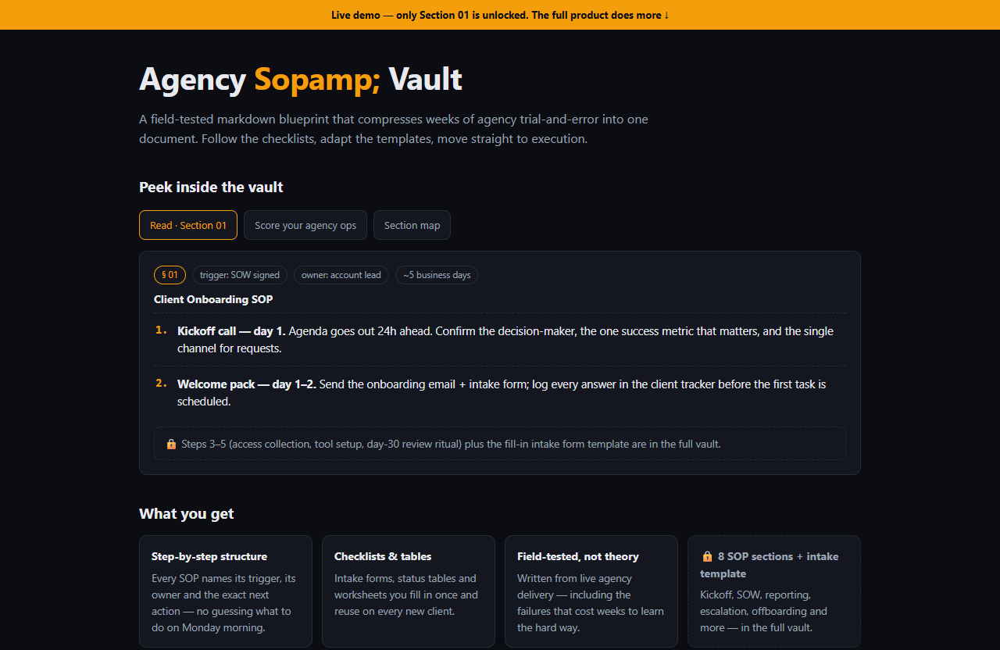

# Agency Sop Vault — live demo

  

  <a href="https://amos-mig.github.io/agency-sop-vault-demo/"><strong>▶ Open the live demo</strong></a> ·
  <a href="https://amosmign.gumroad.com/l/agency-sop-vault"><strong>Get the full product · €7</strong></a>

## What this is

An interactive teaser of the Agency SOP Vault: read a real excerpt of Section 01 (Client Onboarding SOP), browse the full 8-section map, and score your agency's documented ops with a live self-assessment checklist. Locked rows and cards show exactly what stays inside the $7 markdown vault.

**Try it:** Tick boxes in the ops scorecard to get your readiness verdict, read Section 01, then click the dashed locked sections to see what's reserved for the full vault.

## What you get in the full product

- Step-by-step structure — know exactly what to do next
- Checklists and tables you can fill in and reuse
- Written from real-world practice, not theory
- Instant digital download — read it in any markdown viewer or Notion

## About

- **Storefront:** [kits.amosmignery.dev](https://kits.amosmignery.dev) — single-file products, instant download, commercial license
- **Checkout:** [Gumroad](https://amosmign.gumroad.com/l/agency-sop-vault) (Merchant of Record, VAT handled)
- **Full product:** [Agency Sop Vault](https://amosmign.gumroad.com/l/agency-sop-vault) · €7

## License

The demo page in this repo is MIT-licensed — reuse the technique, not the product.
The **Agency Sop Vault** itself is not included here and is not free software.
